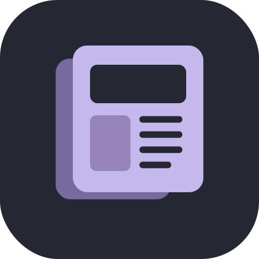

<p align="center"></p>
<h1 align="center">Rassegna Scuola</h1>

Un argomento, cinque notizie di oggi e un documento Word. Un solo repository contiene entrambe le applicazioni: il motore delle notizie, l'esportazione e il controllo aggiornamenti sono condivisi.

| Android | Windows |
| --- | --- |
| Android 10 o successivo | Windows 10/11, x64 |
| Barre di sistema con sfondo opaco fisso, anche in navigazione a gesti | Finestra ridimensionabile con barra laterale |
| Griglia degli argomenti, schede leggibili, condivisione Word | Schede delle notizie, apertura Word e cartella |
| Icona adattiva e monocromatica per icone a tema | Icona ICO e launcher EXE con Java incluso |

Palette ardesia e lavanda, testi essenziali e spaziature ampie.

## Argomenti

Economia · Politica · Geo Politica · Scienze e tecnologia · Sport · Cronaca · Attualità.

Prima di creare la rassegna occorre scegliere l'argomento. Le notizie provengono dai feed ANSA e da ricerche Google News su testate selezionate. Non occorrono account né chiavi API.

La selezione usa la data di pubblicazione nel fuso **Europe/Rome**: questo non prova che l'evento sia accaduto nello stesso giorno. I duplicati e le voci senza data vengono esclusi. Se ci sono meno di cinque risultati idonei, l'app conserva soltanto quelli disponibili. Gli estratti provengono dai feed; Google News può fornire soltanto il titolo, e in quel caso compare «Estratto non disponibile». L'app non genera riassunti con AI e non inventa contenuti mancanti. La pertinenza è una selezione euristica, non una verifica giornalistica; i collegamenti consentono di leggere il contesto. I feed possono cambiare o non essere raggiungibili.

I documenti `.docx` vengono salvati in `Download/RassegnaScuola` su Android e `%USERPROFILE%\Downloads\RassegnaScuola` su Windows. I file hanno un nome con data e ora. La versione iniziale Windows è portatile: estrarre tutta la cartella, non spostare soltanto l'EXE.

## Compilare entrambi da Windows

1. Estrai **tutto** il sorgente ZIP in una cartella locale.
2. Lo script Windows cerca un **JDK 17 x64 completo**. Se manca, scarica automaticamente Temurin 17 portatile in `.build-tools/jdk17`, verifica SHA256 e lo riusa nelle compilazioni successive. Non modifica Java installato nel sistema. Puoi anche installare [Temurin JDK 17 x64](https://adoptium.net/temurin/releases/?version=17) o indicarne il percorso con `RS_JDK17`. JDK 25 e altri JDK incompatibili vengono ignorati.
3. Installa e avvia **Docker Desktop**, con contenitori Linux/WSL 2.
4. Esegui **`build_all.bat`** dalla cartella del progetto.

Risultati in `output/`:

- `RassegnaScuola-debug.apk`
- `RassegnaScuola-3.0.0-windows-x64.zip`

Lo ZIP include anche un APK di prova già compilato in `output/`.

La prima compilazione richiede Internet e diversi GB liberi. Gradle Wrapper scarica Gradle 8.7. Docker prepara JDK 17, SDK Android 35 e Build Tools 35.0.0. Lo script imposta `JAVA_HOME` e `PATH` al JDK 17 selezionato soltanto per il processo di compilazione. Windows usa `jpackage --type app-image` e include il runtime Java: sul PC che usa l'app non serve installare Java. Non servono Visual Studio, WiX o un installer MSI.

Se vuoi compilare un target solo:

```bat
REM Android, con Docker Desktop
docker_build.bat

REM Windows, con JDK 17 x64
build_windows.bat
```

Per eseguire i BAT da PowerShell usa `cmd /c .\build_all.bat`, oppure `cmd /c .\docker_build.bat`. Se un programma tenta di aprirli come documenti, avviali dal terminale.
